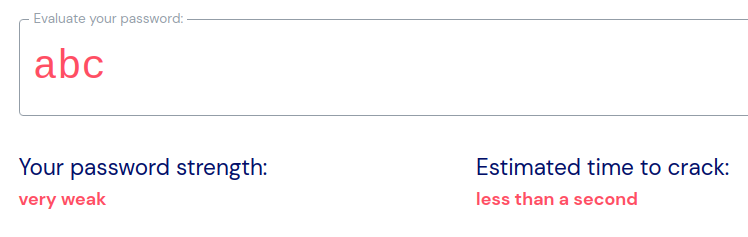
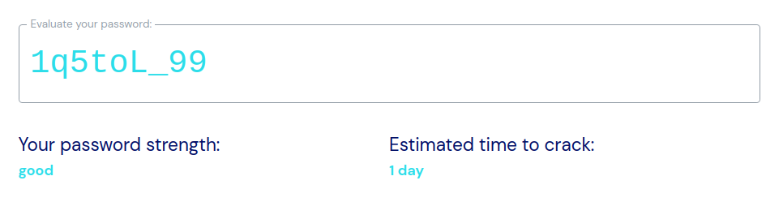
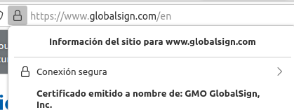
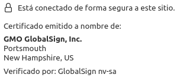

    1.Busca en Internet alguna aplicación que muestre la fortaleza de una contraseña. Utilizando esa aplicación determina la fortaleza de una contraseña con las siguientes características:

    ~~~
    La página que he usado para testear la fortaleza de una contraseña es la siguiente: https://bitwarden.com/password-strength/
    ~~~

        1.Tres caracteres en minúsculas.

        ~~~
        Nos indica que la contraseña es muy débil y que se tardaría menos de un segundo en averiguarla.
        
        ~~~
        2.Siete caracteres mezclando mayúsculas, minúsculas y caracteres especiales.
        ~~~
        Nos indica que la contraseña es fuerte y que se tardaría más tiempo en averiguarla.
        
        ~~~
    
        
    2.Describe detalladamente donde se pueden ver los certificados digitales que hay instalados en un navegador.

    ~~~
     Para ver los certificados digitales de seguridad de un navegador, tenemos primero que dirigirnos a una página cualquiera. Una vez dentro, miramos la barra de búsqueda, donde nos aparece la URL del sitio web. Al lado de esta debería de aparecernos un icono, en el caso de firefox (que es el navegador que he usado) es un candado. Clicamos en él y se nos abre una pequeña pestaña que nos da información del sitio, entre esta info está el certificado de la página en cuestión. Para el resto de navegadores el proceso es distinto.

     

     
    ~~~

    3.Escribe tres acciones que mejorarían la seguridad de un sistema.

    ~~~
    -La primera acción y la más común es el uso de contraseñas más seguras. Por ejemplo, no usar contraseñas de caractéres simples, sino que tengan caractéres variados, números, mayúsculas, minúsculas, etc.
    -Hacer copias de seguridad, para que en caso de cualquier problema se pueda restaurar los datos.
    -Precaución con el ransomware, malware, etc, vigilando los archivos que se descargan o los enlaces en los que se entra.
    Por ejemplo, tenemos que tener cuidado con los emails, mensajes, pendrives desconocidos, etc.
    ~~~

    4.Pon un ejemplo de cada una de las siguientes amenazas:
        1.Interrupción.
        ~~~
        La amenaza de interrupción es aquella amenaza que tiene como objetivo inutilizar o destruir alguna parte del sistema o de la información de dicho sistema.
        Un ejemplo de interrupción sería por ejemplo una ruptura de una línea de comunicación tal como la destrucción de un cable que conecta a internet al sistema.
        ~~~
        2.Interceptación.
        ~~~
        Una amenaza de interceptación es aquella que hace que alguien no autorizado para ver cierta información pueda acceder a ella. Un ejemplo de interceptación sería la copia no autorizada de ficheros.
        ~~~
        3.Modificación.
        ~~~
        Una amenaza de modificación es aquella en la que el usuario no autorizado no solo puede ver la información, sino que también tiene la capacidad de modificarla o alterarla de alguna manera. Un ejemplo sería el acceder de manera ilícita a la información y alterarla.
        ~~~
        4.Fabricación.
        ~~~
        Una amenaza de fabricación es aquella amenaza que se genera debido a algún error o falla del fabricante del producto. Por ejemplo, un atacante puede explotar un error de una pieza de hardware que el fabricante desconocía.
        ~~~

    5.Investiga en Internet y enumera tres sistemas de control de acceso para personas.

    ~~~
    Controles físicos:
    -Uso de sistemas de reconocimiento biométrico, como lectores de credenciales o similar.
    -Barreras físicas, como puertas o controles de seguridad.
    -Guardias de seguridad que controlen el entorno.
    ~~~

    6.Describe brevemente las partes más importantes de las que consta un grupo electrógeno.

    ~~~
    Un grupo electrógeno es, por lo general, un generador o motor, junto con todo lo necesario para que realice su función que se encarga de suministrar electricidad a los equipos y hardware de un lugar en caso de un corte de corriente.
    Las partes principales de un grupo electrógeno son las siguientes:

    -Motor: Genera la fuerza mecánica para que el generador funcione.
    -Regulador de velocidad: Se encarga de regular el motor, para asegurarse que su velocidad (la del alternador) es la adecuada.ç
    -Motor de arranque: Inicia la máquina de combustión.
    -Sistema de refrigeración: Reduce la temperatura del grupo electrógeno.
    -Filtro de aire: Se encarga de filtrar suciedad o impurezas en el aire que puedan dañar al grupo.
    -Aislador de vibración: Reduce la vibración que genera la máquina para evitar daños a esta.
    -Panel de control: En este se administra el funcionamiento de la máquina.
    ~~~

    7.Investiga en qué consiste la tecnología de los “nanotubos” y su aplicación a la construcción de discos duros.

    ~~~
    Los nanotubos son una tecnología que consta de estructuras tubulares de tamaño igual o inferiro a un nanómetro. 
    En el caso de los discos duros, los nanotubos se usan para aumentar la capacidad de almacenamiento de estos.
    El funcionamiento de esta tecnología es el siguiente:
    Un lubricante se extiende por el disco y los nanotubos conducen el vapor de este. Esto se traduce en un aumento de almacenamiento.
    También hay que destacar que si este lubricante se evapora, al no estar ya en contacto con la superficie, se pierden todos los datos.
    ~~~

    8.¿Cuántas claves serían necesarias para que 3 personas se intercambiaran información utilizando cifrado simétrico? ¿Y si fuesen 4 personas?

    ~~~
    Para 3 personas se necesitarían 3 claves y para 4 personas 6 claves.
    ~~~

    9.Describe detalladamente cómo conseguir un certificado digital para una persona jurídica.

    ~~~
    Para solicitar un certificado digital para una persona jurídica tenemos que dirigirnos a la sede electrónica de la Casa de la Moneda y Timbre.
    Para esto, tienes que acreditar todos los datos que te pide la institución.
    ~~~