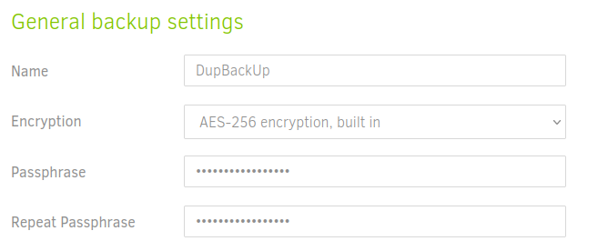

# Copias de seguridad con DUPLICATI

***Nombre:Bruno Amancio González Gorrín***
***Curso:*** 2º de Ciclo Superior de Administración de Sistemas Informáticos en Red.

### ÍNDICE

+ [Introducción](#id1)
+ [Objetivos](#id2)
+ [Material empleado](#id3)
+ [Desarrollo](#id4)
+ [Conclusiones](#id5)

#### ***Introducción***. 

En esta práctica vamos a utilizar la herramienta de copias de seguridad llamada Duplicati. Esta herramienta nos permite realizar copias de seguridad en local y luego podemos subir estas copias a la nube.

#### ***Objetivos***. 

Los objetivos de esta práctica son realizar una copia de seguridad incremental y cifrada, planear un backup de los documentos del sistema y luego realizar una restauración de la copia de seguridad realizada.

#### ***Material empleado***. 

Se emplea una máquina virtual de Ubuntu 20.04, que ya estaba configurada de prácticas anteriores, por lo que tiene red (ip 10.109.26.1). Además, hay que instalar el software de duplicati, que será el que se encargue de realizar las copias de seguridad que le programemos. 

#### ***Desarrollo***. 

Lo primero que hacemos es obtener duplicati con el siguiente comando, para luego instalarlo.

Instalamos duplicati.

Y realizamos el siguiente comando para eliminar el problema de las dependencias.

Ahora comprobamos que duplicati se ha instalado correctamente.

Y activamos el servicio, porque sino no funcionaría. Luego comprobamos el estado del servicio para comprobar si está activo (active).

Lanzamos duplicati mediante terminal simplemente escribiendo duplicati en este.

Al hacer esto, se lanza el servicio y se nos abre el navegador, siendo redireccionados automáticamente a la siguiente página.

Ahora, para hacer la copia de seguridad de los archivos que queremos, abrimos el menú desplegable y clicamos en "add backup (añadir copia de seguridad)"

Se nos abre la siguiente pestaña, donde clicamos en "configurar nueva copia de seguridad".

Pero, antes de continuar tenemos que elegir una carpeta alojadad en un servicio de nube, como Drive, Dropbox, etc. En este caso uso Google Drive. La carpeta que se crea tiene el nombre siguiente.

Ahora, teniendo creada la carpeta, continuamos haciendo la backup. En la siguiente pestaña se elige el servicio que vamos a usar (Drive), la carpeta y creamos el AuthID.

Testeamos la conexión.

Elegimos lo que queremos que se copie en la backup, en este caso mis documentos.

Configuramos la frecuencia de la backup. En este caso se hará todos los días a las 23.30.

Añadimos una contraseña para que nos deje continuar.

Vemos que la copia se ha configurado tal y como queríamos.

Vamos a ejecutar la copia manualmente. Damos en run now.

Comienza.

Va progresando.

Vamos a Drive y vemos que se ha hecho la copia.

Quedaría restaurar la copia, pero debido a que cree una nueva copia porque no se guardó correctamente la anterior en la carpeta de Drive. El problema es que se genera un nuevo AuthID que no funciona y no hay conexión entre Drive y Duplicati. Debido a esto, no puedo terminar la parte de la restauración.

> ***IMPORTANTE:*** si estamos capturando una terminal no hace falta capturar todo el escritorio y es importante que se vea el nombre de usuario.

Si encontramos dificultades a la hora de realizar algún paso debemos explicar esas dificultades, que pasos hemos seguido para resolverla y los resultados obtenidos.

#### ***Conclusiones***. 

Con Duplicati hemos aprendido a hacer copias de seguridad automáticamente del sistema. Es una herramienta muy útil para evitar sorpresas al perder ciertos archivos.