

# RSYNC

***Nombre: Bruno Amancio González Gorrín***
***Curso:*** 2º de Ciclo Superior de Administración de Sistemas Informáticos en Red.

### ÍNDICE

+ [Introducción](#id1)
+ [Objetivos](#id2)
+ [Material empleado](#id3)
+ [Desarrollo](#id4)
+ [Conclusiones](#id5)

#### ***Introducción***. 

En esta prácica vamos a hacer uso de la herramienta Rsync que ofrece transmisión eficiente de datos incrementales entre máquinas.

#### ***Objetivos***. 

El objetivo de esta práctica es el de instalar el servicio Rsync en nuestra máquina virtual y posteriormente hace uso de esta herramienta en conjunto con nuestro compañero para comprobar que funciona correctamente.
Además, hay que crear 100 txt y con rsync pasarlos a la otra máquina. Luego hay que borrar un archivo y buscar la manera de que no aparezca en la otra máquina.

#### ***Material empleado***. 

Dos máquinas virtuales Ubuntu 20.04 con interfaz gráfica.

#### ***Desarrollo***. 

***IMPORTANTE***
A lo largo de las capturas se puede ver un cambio en los nombres de las máquinas. Esto se debe a que durante el desarrollo de la práctica, la máquina rsync2 dejó de funcionar, y para evitar perder tiempo instalando otra máquina, cloné una de mis máquinas a mi compañero, de ahí que en algunas capturas se vea un nombre u otro. En este caso, la máquina de nombre bruno es la máquina rsync1 y la máquina gonzalez21b es la máquina rsync2.

Lo primero es configurar una dirección IP para las máquinas. Usamos la dirección MAC que nos ha proporcionado el profesor y en conjunto usamos configuración DHCP para que nos la asigne dinámicamente.

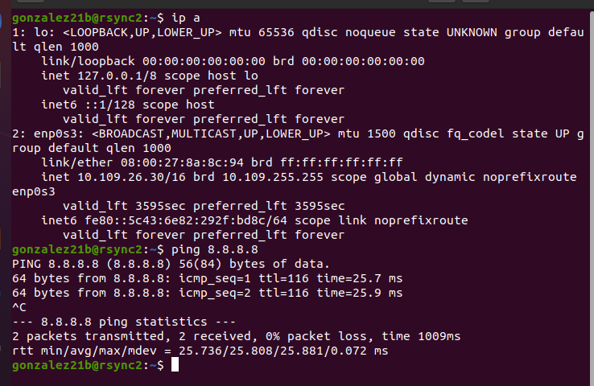

Hacemos ping a la máquina rsync2.

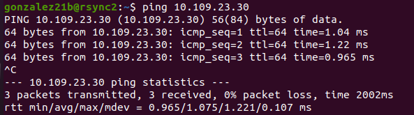

Y a la máquina rsync1.

Comprobamos que el servicio está activo y corriendo.

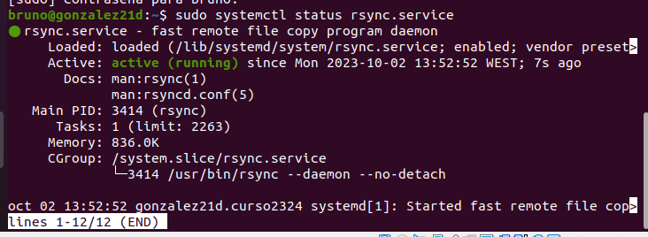

Hecho esto, creo en mi MV una carpeta datos donde se crearán los archivos de texto.

Con el siguiente comando creamos 100 archivos de texto.

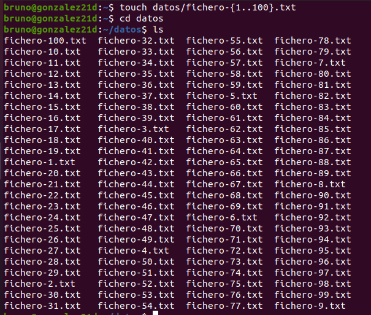

Sincronizamos las dos máquinas de manera que todos los archivos creados en datos se pasen a la otra mv. Esto se hace con el siguiente comando.

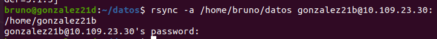

Comprobamos en la máquina dos que se ha creado correctamente.

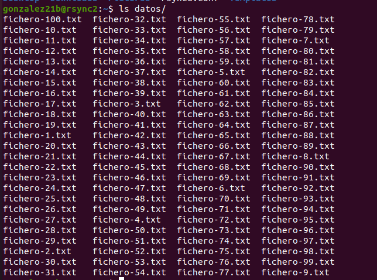

Desde la otra máquina cambiamos un archivo de texto y lo enviamos de vuelta a la máquina uno.

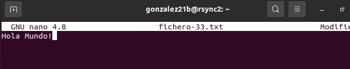

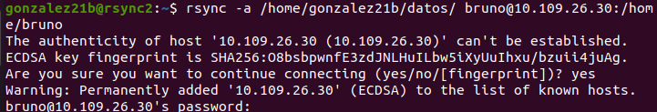

Desde la máquina uno comprobamos que se ha pasado correctamente.

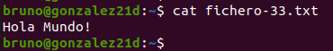

Ahora borramos un fichero, en este caso el 100, para comprobar si haciendo esto este fichero desaparece también de la otra máquina o no.

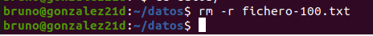

Vemos que no se borra.

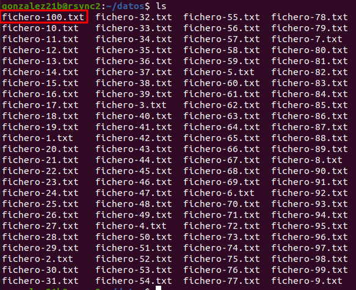

Para que se borre correctamente tenemos que hacer el siguiente comando en la máquina uno.

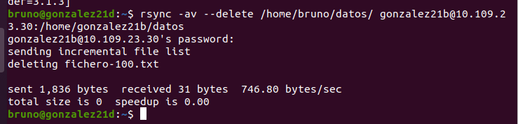

De esta manera se borra el archivo 100, como se puede leer en la quinta línea de comando.
Hay que hacer una copia recursiva de un equipo a otro. Esto se hace con el siguiente comando.

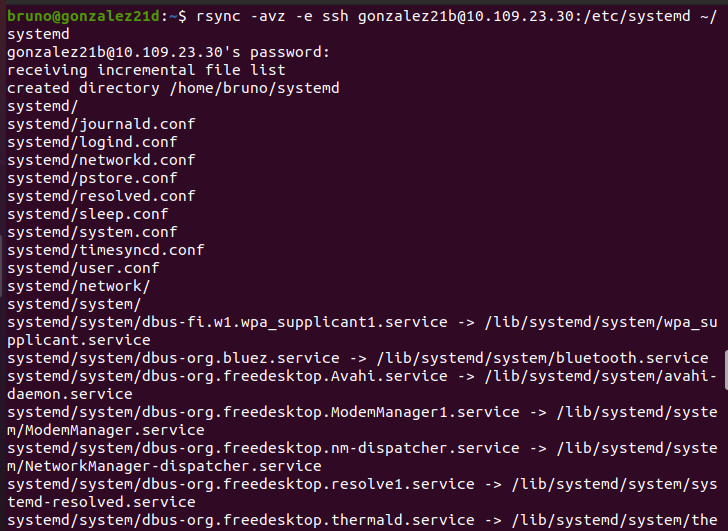

Para hacer una copia incremental usamos el comando siguiente.

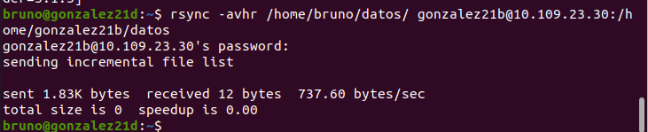

> ***IMPORTANTE:*** si estamos capturando una terminal no hace falta capturar todo el escritorio y es importante que se vea el nombre de usuario.

Si encontramos dificultades a la hora de realizar algún paso debemos explicar esas dificultades, que pasos hemos seguido para resolverla y los resultados obtenidos.

#### ***Conclusiones***. 

Con esta práctica hemos conseguido manejar rsync correctamente y hemos aprendido a utilizar las funciones que nos ofrece.