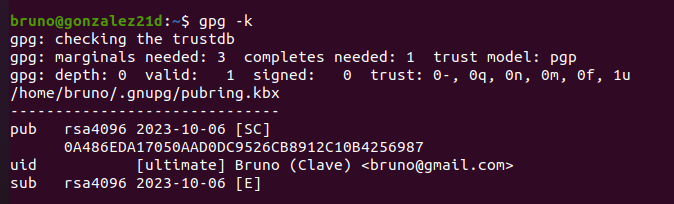

# GPG

***Nombre:Bruno Amancio González Gorrín y Hugo Suárez Pérez***
***Curso:*** 2º de Ciclo Superior de Administración de Sistemas Informáticos en Red.

### ÍNDICE

+ [Introducción](#id1)
+ [Objetivos](#id2)
+ [Material empleado](#id3)
+ [Desarrollo](#id4)
+ [Conclusiones](#id5)

#### ***Introducción***. 

En esta práctica vamos a hacer uso de la herramienta de cifrado GPG en una máquina Linux.

#### ***Objetivos***. 

El objetivo es generar una clave que se compartirá con nuestro compañero y viceversa. De esta manera, si nosotros le enviámos un mensaje cifrado, él es capaz de verlo al tener nuestra clave. Lo mismo pasaría si el que envía el mensaje es la otra persona.

#### ***Material empleado***. 

Dos máquinas virtuales Ubuntu 20.04.

#### ***Desarrollo***. 

Lo primero que tenemos que hacer es generar la clave que luego vamos a compartir con nuestro compañero. Esto se hace con el siguiente comando.

Las genera Hugo

Nos pide que le asignemos una contraseña para proteger nuestra nueva clave. Como esto es una práctica, creo una contraseña fácil de recordar.

Vemos la nueva clave que hemos creado.

La de Hugo.

Hacemos cat para ver la clave completa. Es la siguiente.

Nuestro compañero nos tiene que pasar su clave, que ha generado con el mismo procedimiento que nosotros. El proceso para importar esta clave es el siguiente.

Se importa la clave en el PC de Hugo.

Para comprobar que se encriptan correctamente los mensajes, vamos a crear un archivo llamado "hola" con un mensaje aleatorio dentro, en este caso "hola". Luego encriptamos con el siguiente comando.

Se nos crea un nuevo archivo, pero con extensión distinta, en este caso .asc. Si abrimos el mensaje vemos el mensaje encriptado.

Al hacer el desencriptado nos pide la contraseña.

Y vemos que se desencripta.

Y leemos el archivo mediante la interfaz gráfica.

Hugo hace el mismo proceso que el anterior pero con el archivo que le paso yo.

> ***IMPORTANTE:*** si estamos capturando una terminal no hace falta capturar todo el escritorio y es importante que se vea el nombre de usuario.

Si encontramos dificultades a la hora de realizar algún paso debemos explicar esas dificultades, que pasos hemos seguido para resolverla y los resultados obtenidos.

#### ***Conclusiones***. 

Hemos aprendido a usar la herramienta GPG para encriptar mensajes entre equipos.