

# BITWARDEN COMO GESTOR DE CONTRASEÑAS Y LA 2FA

***Nombre:Bruno Amancio González Gorrín y Hugo Suárez Pérez***
***Curso:*** 2º de Ciclo Superior de Administración de Sistemas Informáticos en Red.

### ÍNDICE

+ [Introducción](#id1)
+ [Objetivos](#id2)
+ [Material empleado](#id3)
+ [Desarrollo](#id4)
+ [Conclusiones](#id5)

#### ***Introducción***. 

En esta prácica vamos a usar el gestor de contraseñas y de autenticación en dos pasos. Con esta aplicación conseguiremos almacenar de forma segura nuestras contraseñas para que nos sea más cómodo el logear en las cuentas, sin perder el factor de seguridad con ello.

#### ***Objetivos***. 

    -Cada miembro del grupo debe usar una máquina virtual con el sistema operativo a elegir que tenga interfaz gráfica, ya que vamos a hacer uso del navegador. En dicha máquina, cada uno debe descargar la versión de  Bitwarden compatible con el sistema operativo escogido, proceder a la inslación y a la creación de una cuenta personal gratuita en la que alojar tus contraseñas.
    -Cada miembro del grupo descargará la extensión para el navegador que uses en esa máquina virtual, procediento  a la instalación y el login con la cuenta que has creado en el punto anterior.
    -Para generar los códigos del 2FA vamos a utilizar la propia app de Bitwarden, debes configurar los códigos de doble factor.
    -Configura el acceso a una cuenta Gmail y configura la “autenficación de doble factor para la misma”.
    -Para probar el acceso seguro debes logearte en la máquina virtual de tu compañero de modo que el sistema te pida el 2FA 🚨 ES IMPORTANTE NO GUARDAR LA CONTRASEÑA EN EL NAVEGADOR DE LA MÁQUINA VIRTUAL DEL COMPAÑERO DE GRUPO 🚨
    -Instala la app ( Bitwarden ) en tu teléfono móvil y úsala para logearte en la cuenta Gmail creada, comprobando que para hacerlo se use el 2FA.

#### ***Material empleado***. 

Dos máquinas vituales de Ubuntu 20.04 y nuestros dispositivos móviles.

#### ***Desarrollo***. 

Vamos a comenzar instalando Bitwarden mediante la terminal de la siguiente manera.
En la máquina de Bruno.

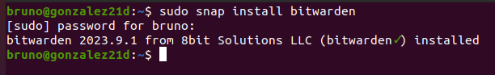

En la máquina de Hugo.

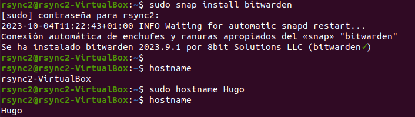

Entramos en bitwarden poniendo en la terminal el nombre de la aplicación.

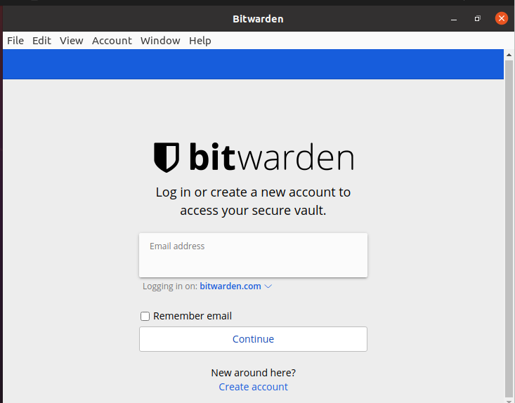

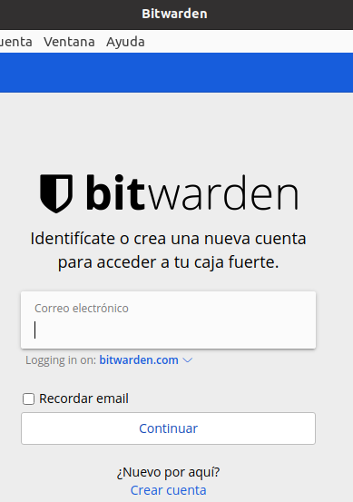

Se nos pide un correo, por lo que cogemos uno ya existente.

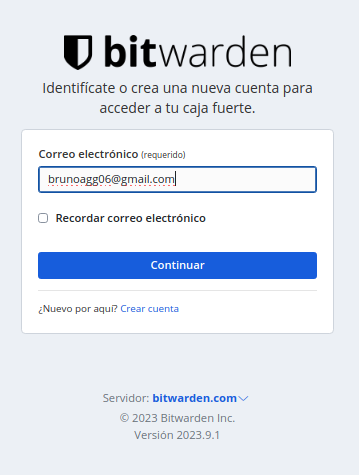

Y una contraseña.

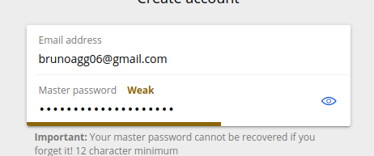

Entramos después de esto en bitwarden.

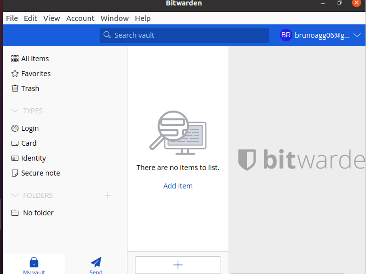

Ahora tenemos que añadir una extensión al navegador que vamos a usar para que se guarden nuestras contraseñas y luego podamos introducirlas rápidamente.

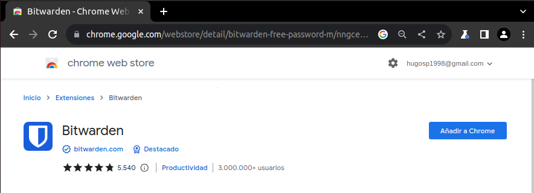

Confirmamos.

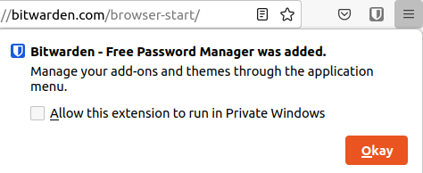

Se nos abre la siguiente pestaña.

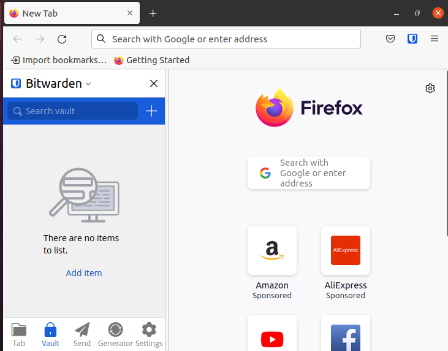

Ahora vamos a logearnos en Gmail para poder guardar la contraseña. Deslogueamos primero.

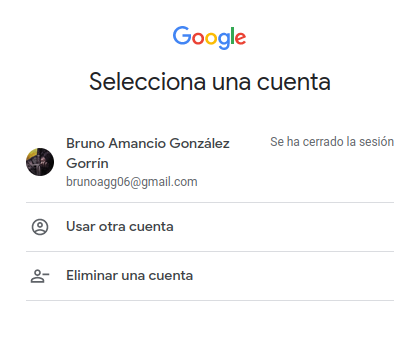

Y ahora viendo que se nos ha guardado la contraseña volvemos a entrar.

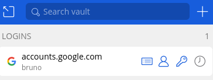

Se nos rellena clickando en la pestaña anterior.

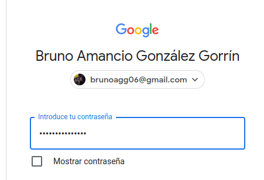

Para que nos pida 2FA para gmail tenemos que activar la opción de usar una aplicación externa para esto. Lo hacemos en la siguiente pestaña.

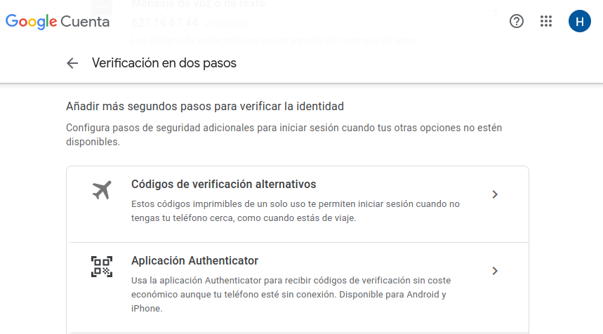

Añadimos.

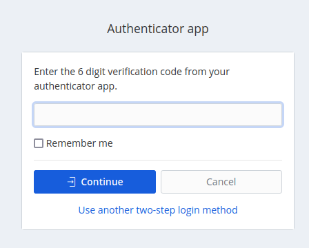

Y probamos que funciona entrando de nuevo a la cuenta.

Para hacer lo mismo pero con bitwarden entramos en la sección de seguridad y activamos el 2FA.

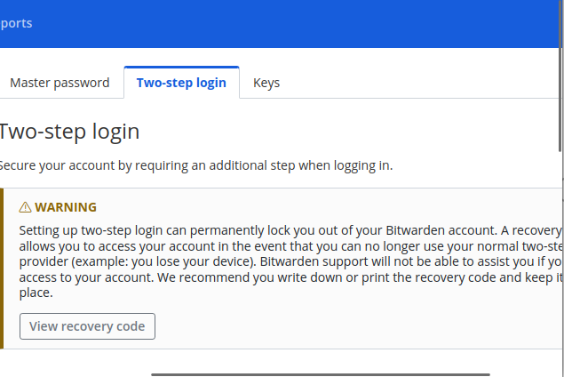

Vemos que se activa.

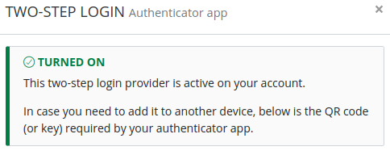

Y nos pide de nuevo el 2FA a la hora de entrar en bitwarden.

Entramos sin problemas a la aplicaión web.

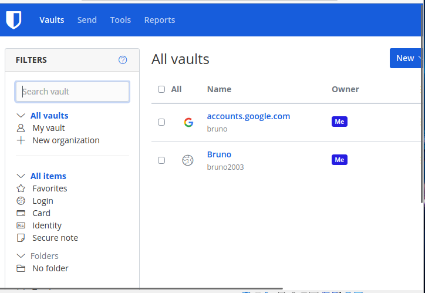

> ***IMPORTANTE:*** si estamos capturando una terminal no hace falta capturar todo el escritorio y es importante que se vea el nombre de usuario.

Si encontramos dificultades a la hora de realizar algún paso debemos explicar esas dificultades, que pasos hemos seguido para resolverla y los resultados obtenidos.

#### ***Conclusiones***. 

Con esta práctica hemos aprendido a utilizar el gestor de contraseñas Bitwarden, que es muy útil a la hora de almacenar nuestras contraseñas, facilitando el acceso sin comprometer la seguridad.
