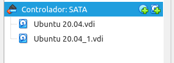

# Clonación de discos mediante Clonezilla

***Nombre:Bruno Amancio González Gorrín y Hugo Suárez Pérez***
***Curso:*** 2º de Ciclo Superior de Administración de Sistemas Informáticos en Red.

### ÍNDICE

+ [Introducción](#id1)
+ [Objetivos](#id2)
+ [Material empleado](#id3)
+ [Desarrollo](#id4)
+ [Conclusiones](#id5)

#### ***Introducción***. 

En esta práctica vamos a usar la herramienta de clonación de discos y particiones de Clonezilla.

#### ***Objetivos***. 

+Probar Clonezilla cliente para clonar una partición en otra partición. Para ello utilizaremos máquinas virtuales y añadiremos un segundo disco duro a una máquina existente.

+Probar clonezilla con un servidor SSH y con otro SMB.

#### ***Material empleado***. 

Dos MV Ubuntu 20.04.

#### ***Desarrollo***. 

Partimos de unas máquinas Ubuntu ya creadas, por tanto no vamos a mostrar nada de la configuración.

Para comenzar, añadimos un disco extra.

Para usar Clonezilla, tenemos que usar la ISO y arrancar la MV con ella, de la siguiente manera.

Vemos el disco nuevo que añadimos.

En la MV de Hugo:

Para montar y poder clonar el disco, tenemos que usar Gparted. No es obligatorio, pero es más cómodo hacerlo de esta manera.

Entramos.

Tenemos que añadir un usuario nuevo llamado mantenimiento.

Hacemos la partición correspondiente (extendida), y luego apagamos la MV y lanzamos Clonezilla.

Nos recibe la siguiente pestaña, donde pulsamos Iniciar.

Hacemos de partición a partición, ya que no queremos clonar el disco completo.

De local a local.

Aquí elegimos el disco origen.

Y en la siguiente página elegimos el disco destino, es decir, donde vamos a clonar el disco origen.

Continuamos y comienza la clonación.

Vamos a intentar ahora botear desde la partición clonada. En esta pantalla apretamos el 3.

Vemos que se inicia el SO de manera correcta, tal como se iniciaría con el disco origen.

Ya que hemos logrado clonar localmente de manera correcta, ahora vamos a hacerlo vía SSH, es decir, de máquina remota a máquina remota.

La forma de proceder es similar. Entramos en Clonezilla y elegimos ssh_server.

En la página siguiente se tendría que añadir la dirección IP de la máquina a la que queremos clonar el disco.

Nos pide otras cosas, como máscara, servidor DNS y el disco que queremos clonar. Usamos el mismo que antes.
Iniciamos la clonación.

Es importante que nuestro compañero tenga creada una carpeta llamada partimag, que es donde se nos guardará la clonación.

Se nos inicia sin problemas la clonación.

> ***IMPORTANTE:*** si estamos capturando una terminal no hace falta capturar todo el escritorio y es importante que se vea el nombre de usuario.

Si encontramos dificultades a la hora de realizar algún paso debemos explicar esas dificultades, que pasos hemos seguido para resolverla y los resultados obtenidos.

#### ***Conclusiones***. 

Hemos aprendido a usar la herramienta de clonado de discos y particiones Clonezilla, tanto de forma local (de disco a disco) como de manera remota (de máquina a máquina).