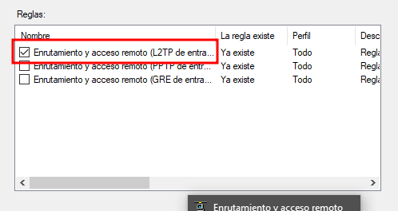
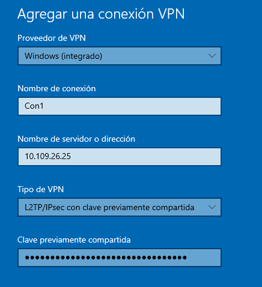
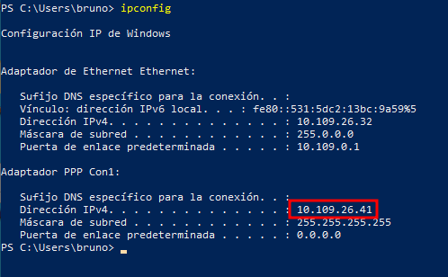

# UT4-A2 VPN EN WINDOWS SERVER

***Nombre: Bruno Amancio González Gorrín***
***Curso:*** 2º de Ciclo Superior de Administración de Sistemas Informáticos en Red.

### ÍNDICE

+ [Introducción](#id1)
+ [Objetivos](#id2)
+ [Material empleado](#id3)
+ [Desarrollo](#id4)
+ [Conclusiones](#id5)

#### ***Introducción***. 

El objetivo de esta práctica es el de configurar el servicio VPN en una máquina de Windows Server y posteriormente conectarse correctamente desde una máquina cliente, que en este caso será una Windows 10.

#### ***Objetivos***. 

1 - Configurar el servicio VPN en Windows Server

2 - Comprobar su funcionamiento correctamente en Windows 10

3 - Verificar que el VPN nos redirecciona al acceder a internet

#### ***Material empleado***. 

- Una MV Windows Server

- Una MV Windows 10

#### ***Desarrollo***. 

Si queremos configurar el servicio VPN en una máquina de Windows Server, lo primero que debemos hacer es instalar el servicio. Esto lo haremos usando el Administrador del Servidor y agregando roles y características.

El rol en concreto sería el de Acceso remoto, como se ve en la siguiente captura -->

Si continuamos la instalación, se nos abrirá una nueva ventana donde nos preguntarán qué servicios del rol queremos instalar. En nuestro caso, necesitaremos instalar el de Enrutamiento, que depende de DirectAccess y VPN, por lo que lo tendremos que instalar de igual manera -->

Ahora tendríamos el servicio instalado. Vamos a configurar el enrutamiento y acceso remoto desde la aplicación de mismo nombre. Configuraremos nuestro servidor. 

Para la configuración se nos abre un asistente -->

Utilizaremos la configuración personalizada y en esta tendremos que habilitar el acceso a VPN y el NAT -->

Iniciamos el servicio en la siguiente pantalla -->

Vemos que una vez hayamos configurado todo, nos aparecerán todas las opciones de configuración de nuestro servidor local -->

Ahora nos dirigimos a las propiedades del servidor y pegamos la clave compartida (generada previamente usando el asistente de Google Cloud). Es importante acordarse de esta clave, ya que la tendremos que usar en el equipo cliente también. El resto en esta pestaña la dejamos por defecto -->

Continuamos y asignamos un rango de direcciones IP para que se asignen a nuestros equipos clientes. Las direcciones serán las siguientes -->

Si continuamos, necesitaremos configurar el NAT. Se hace en la misma página de enrutamiento y acceso remoto. Usaremos Ethernet -->

En las propiedades del NAT, tendremos que habilitar la interfaz pública conectada a internet y también habilitar el NAT en dicha interfaz -->

Editamos el servicio y asignamos como dirección privada la dirección IP del localhost. El resto lo dejamos igual -->

Ahora tendremos que modificar las reglas del Firewall de Windows. Añadimos una nueva regla para el Firewall -->

La regla será predefinida y la que usaremos será la de enrutamiento y acceso remoto -->

Si ahora queremos usar L2TP (que es el que vamos a usar) tenemos que seleccionarlo, como se ve en la captura siguiente -->

Continuamos. Tenemos que permitir la conexión, independientemente si es segura o no -->

Con esto configurado, ahora vamos a crear un usuario, que será el que usaremos para realizar la conexión al VPN. Lo crearíamos de la siguiente manera -->

Una vez creado el usuario, tenemos que modificar el acceso a redes de este. Lo hacemos desde las propiedades del usuario -->

Tenemos todo lo necesario para establecer una conexión desde un cliente remoto al VPN que hemos configurado. 

Nos dirigimos a la configuración de red del cliente y añadimos un VPN en su respectivo apartado. En esta pestaña, rellenamos lo que se nos pide -->

En la clave tendremos que escribir la que usamos anteriormente en el equipo servidor.

IMPORTANTE: En el caso de que no podamos conectarnos a nuestra VPN, cambiaremos el tipo de VPN a automático. Una vez conectados, podremos cambiar el tipo de nuevo.

Finalizamos esto y vemos que nos aparece nuestra nueva conexión VPN -->

Es importante tener en cuenta que cuando se añade nuestro VPN, nuestro equipo no se conectará automáticamente, tendremos que clicar en la conexión y conectarnos manualmente. Lo hacemos y se conecta correctamente -->

Ahora deberíamos de estar conectados correctamente a nuestro VPN, podemos hacer un ipconfig para ver si estamos saliendo a internet vía la IP que hemos configurado con el servicio -->

Vemos que en la segunda interfaz salimos con la dirección 41. Teniendo en cuenta que el rango de direcciones es de la 40 a la 50, estaríamos usando la primera dirección disponible, por lo que está funcionando.
#### ***Conclusiones***. 

En esta parte debemos exponer las conclusiones que sacamos del desarrollo de la prácica.