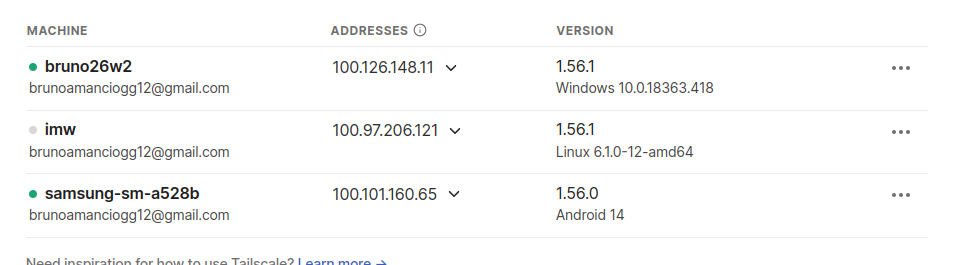
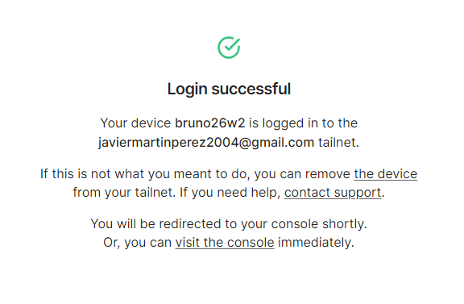

# TAILSCALE

***Nombre: Bruno Amancio González Gorrín***
***Curso:*** 2º de Ciclo Superior de Administración de Sistemas Informáticos en Red.

### ÍNDICE

+ [Introducción](#id1)
+ [Objetivos](#id2)
+ [Material empleado](#id3)
+ [Desarrollo](#id4)
+ [Conclusiones](#id5)

#### ***Introducción***. 

Vamos a crear una red VPN donde agregaremos varias máquinas: una Windows, una Debian y un teléfono móvil. Además agregaremos una máquina de un compañero para comprobar que nuestra VPN funciona fuera de nuestro entorno.

#### ***Objetivos***. 

Configurar Tailscale para:

    - Que funcione en una máquina Windows
    - Que funcione en una máquina Debian
    - Que funcione en un móvil
    - Que funcione en un compañero
    - Que nos muestre las webs de nuestra MV Debian en remoto

#### ***Material empleado***. 

- Un móvil
- Una MV Windows
- Una MV Debian

#### ***Desarrollo***. 

Vamos a comenzar por descargar Tailscale en una máquina Windows, que será la primera que vamos a enlazar a nuestra red (previamente nos hemos registrado en la página oficial).

El proceso de instalación es el mismo que cuando descargamos prácticamente cualquier aplicación nueva desde Windows, usando un asistente de instalación.

Si una vez instalada entramos en la app, se nos linkeará automáticamente con la cuenta que nos hayamos logueado en Tailscale. Si vamos al apartado de "Machines", vemos nuestra nueva máquina.

Vamos a añadir un teléfono móvil. Esto lo hacemos de igual manera, descargando la aplicación e iniciando sesión.

Ahora nos vamos a descagar Tailscale en una máquina Debian. En este SO el proceso es distinto, ya que tenemos que hacerlo con un curl. Por suerte para nosotros, en la página de Tailscale nos da el comando entero para la instalación.

Con Tailscale instalado, hacemos tailscale up y nos autenticamos accediendo al enlace que nos genera el comando.

Si regresamos a "Machines" (que son donde nos muestran todas las máquinas que tenemos en nuestra red) vemos que tenemos todos los dispositivos.

Ahora teniendo en cuenta que tenemos la máquina de IMW, que es donde tenemos hosteado nuestra página web de Nginx de las series, si usamos nuestro nombre de DNS de Tailscale combinado con el nombre de la máquina y /series, deberíamos de poder ver esta página desde otra máquina de la red.

Si queremos que se vea esta página desde otra máquina que sea ajena a la red, tendríamos que habilitar el funnel usando el debido comando.

Este comando nos generará un enlace que podemos compartir con otras personas para acceder a nuestra web. El enlace resultante es el siguiente: 

https://imw.pitta-danio.ts.net/

Vamos ahora a probar con un compañero, en mi caso lo pruebo con Javier. Lo primero a hacer es añadirlo a la red.

Si yo me quiero loguear a su red, uso el enlace de invitación.

Estando ambos en las respectivas redes, deberíamos de poder ver nuestras páginas, en mi caso debería de poder ver la página hosteada por Javier. Probamos.

#### ***Conclusiones***. 

Hemos configurado el servicio VPN Tailscale y hemos visto nuestras páginas hosteadas en una de nuestras máquinas.