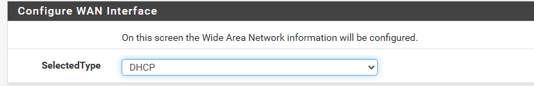
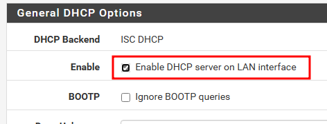
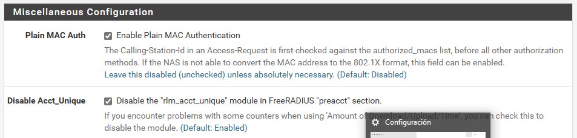

# TÍTULO DE LA PRÁCTICA

***Nombre: Bruno Amancio González Gorrín***
***Curso:*** 2º de Ciclo Superior de Administración de Sistemas Informáticos en Red.

### ÍNDICE

+ [Introducción](#id1)
+ [Objetivos](#id2)
+ [Material empleado](#id3)
+ [Desarrollo](#id4)
+ [Conclusiones](#id5)

#### ***Introducción***. 

pfSense1​ es una distribución personalizada de FreeBSD adaptado para su uso como Firewall y Enrutador. Se caracteriza por ser de código abierto, puede ser instalado en una gran variedad de ordenadores, y además cuenta con una interfaz web sencilla para su configuración.

#### ***Objetivos***. 

-   Instalar y configurar pfsense
-   Configurar wifiradius

#### ***Material empleado***. 

-   Una MV Ubuntu (servidor)
-   Una MV Windows (cliente) 

#### ***Desarrollo***. 

Necesitaremos dos interfaces de red en nuestra MV servidor.

Metemos la ISO de pfsense.

Comenzamos con la instalación usando la interfaz de pfsense.

Finalizamos la instalación y nos recibe el menú de pfsense.

Se nos abre el menú en la terminal donde nos da la IP que tendremos que usar.

Vamos a asignar una IP estática dentro de la misma red. Más tarde lo cambiaremos a DHCP.

Si entramos en la IP vía navegador nos abrirá el inicio de sesión de pfsense.

Entramos usando "admin" y "pfsense" como usuario y contraseña, respectivamente.

Configuramos el nombre del host y el dominio.

Configuramos la interfaz WAN para que sea DHCP.

Y la interfaz LAN la vamos a configurar con la IP siguiente, con su respectiva máscara de red.

Hecho esto, nos recibe el "Dashboard" de pfsense.

Tendremos que habilitar el DHCP en la interfaz LAN.

Comprobamos ahora que nos ha dado la IP el servicio DHCP. Esta tiene que estar dentro de un rango especificado.

Buscamos ahora freeradius para añadirlo a la pestaña de servicios.

Editamos la configuración de las interfaces.

Añadimos dos usuarios nuevos. Uno se llamará alumno y otro se llamará bruno.

Habilitamos la autenticación MAC y deshabilitamos "Acct_Unique".

Tenemos esto configurado. Ahora vamos a especificarle a pfsense que use la interfaz LAN, que es la que tenemos configurada para esto.

Ahora tendremos que asignar el server de autenticación. No lo hemos creado, por lo que de momento lo dejamos así.

Ahora creamos lo anterior, con los siguientes datos.

Con esto creado, ahora vamos a asignar esto en la página anterior.

Ya tendríamos todo configurado.

#### ***Conclusiones***. 

Hemos aprendido a configurar pfsense para que nos brinde servicios de enrutamiento y firewall.