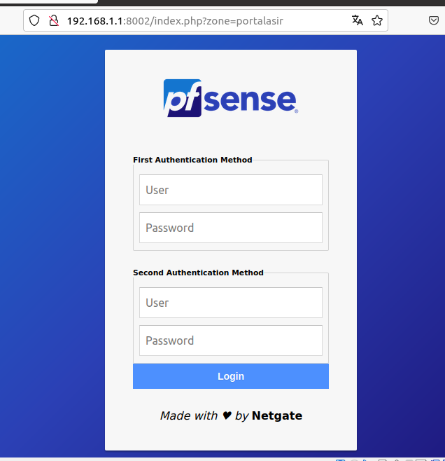
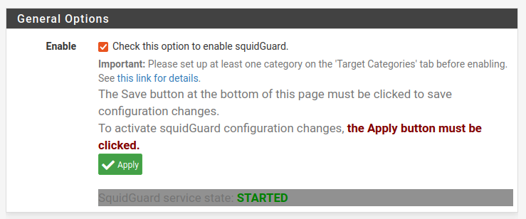
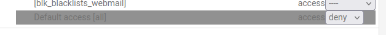
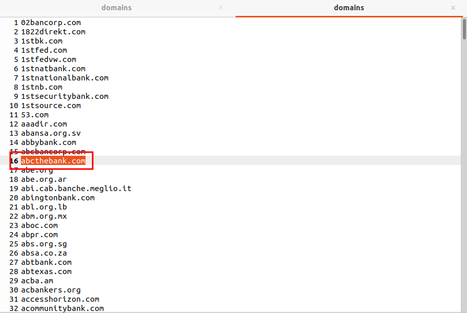
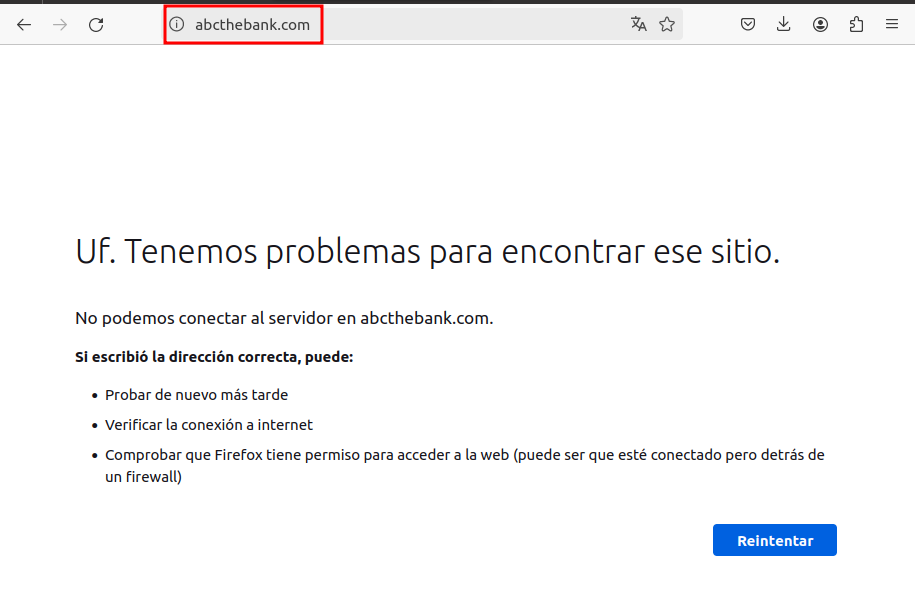
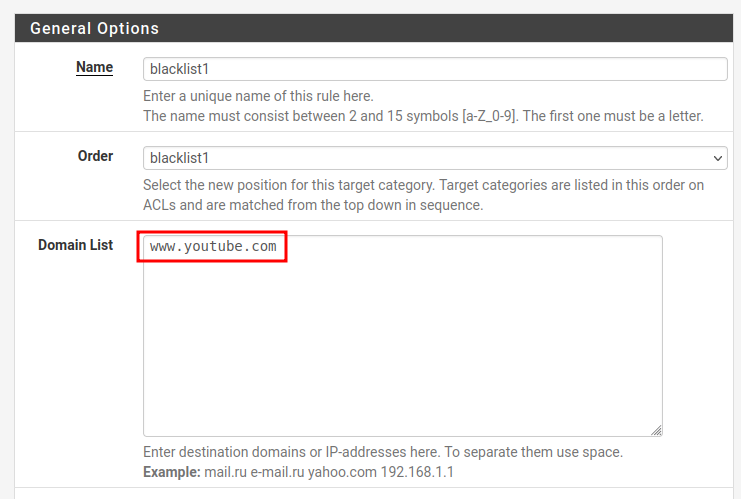
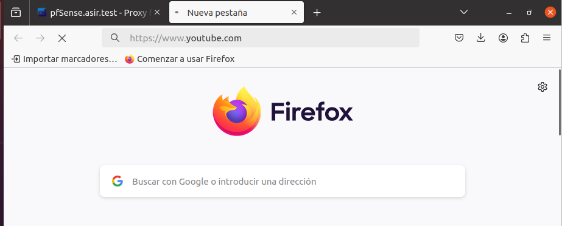
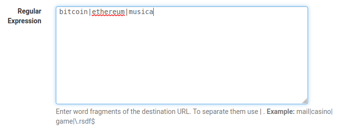

# CONFIGURACIÓN DE UN PROXY USANDO PFSENSE

***Nombre: Bruno Amancio González Gorrín***
***Curso:*** 2º de Ciclo Superior de Administración de Sistemas Informáticos en Red.

### ÍNDICE

+ [Introducción](#id1)
+ [Objetivos](#id2)
+ [Material empleado](#id3)
+ [Desarrollo](#id4)
+ [Conclusiones](#id5)

#### ***Introducción***. 

pfSense1​ es una distribución personalizada de FreeBSD adaptado para su uso como Firewall y Enrutador. Se caracteriza por ser de código abierto, puede ser instalado en una gran variedad de ordenadores, y además cuenta con una interfaz web sencilla para su configuración.

#### ***Objetivos***. 

- El objetivo de esta práctica es montar un servidor proxy sobre PFSense que nos va a permitir conectarnos desde Internet a nuestra red local desde prácticamente cualquier dispositivo que soporte VPNs. Para ello en el servidor vamos a instalar y configurar pptpd que es un servidor de protocolo PPTP.

- La VPN que vamos a montar será una VPN de acceso remoto y va a permitir que clientes desde sitios remotos se puedan conectar a nuestra red local y trabajar como si estuvieran en la misma red.

#### ***Material empleado***. 

- Una máquina virtual Ubuntu que actuará de servidor.

- Una máquina virtual de Ubuntu que actuará de cliente.

#### ***Desarrollo***. 

Lo primero que tenemos que hacer es instalar los paquetes necesarios usando el instalador de paquetes -->

Luego tenemos que borrar los servidores DNS o gateways que tengamos.

Entramos al portal cautivo.

Una vez nos hemos verificado, tenemos que activar el proxy con la IP de nuestro servidor. Esto lo hacemos desde el cliente -->

Ahora vamos a instalar el paquete SquidGuard, del cual ya tenemos las dependencias, que hemos intalado en los pasos anteriores. Usaremos el instalador de paquetes -->

Ahora, si queremos añadir una blacklist o lista negra, tendremos que dirigirnos al menú de SquidGuard y la añadiremos aquí. Se nos descargará.

Para poder iniciar el SquidGuard, tenemos que iniciar previamente el paquete Squid, que es el paquete principal del que depende el primero.
Una vez iniciado Squid, SquidGuard se activará.

Ahora para poder bloquear todas las direcciones de la blacklist, tenemos que ir a la la pestaña de las ACL, donde podremos bloquear todas las direcciones que contiene la blacklist descargada.

Vamos a probar. Podemos abrir el archivo .tar para leer los dominios que tenemos bloqueados y leer un txt aleatorio. Yo he probado con las páginas de bancos bloqueados.

Si probamos a entrar en la página anterior, vemos que se nos ha bloqueado.

Si queremos intentar añadir una página que no esté en nuestra blacklist, tenemos que añadirla manualmente en la pestaña siguiente -->

Intentamos entrar.

Aunque no se aprecie, la página no carga.

Si ahora queremos filtrar por contenido, es similar a la anterior, solo que tendremos que escribir palabras clave. Por ejemplo, bitcoin, ethereum, musica. Para filtrar esto, podemos hacerlo de la siguiente manera -->

Esto filtraría todas las webs que contengan palabras clave como estas.

#### ***Conclusiones***. 

Hemos aprendido a configurar un proxy usando PFSense, además de añadir listas negras para evitar que se puedan acceder a las páginas que estas contienen.